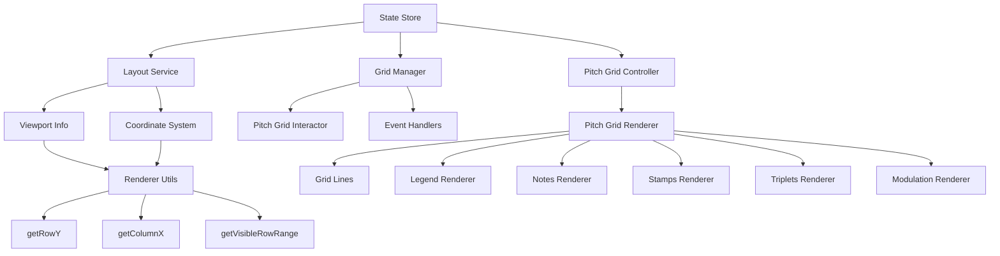

# Student Notation Pitch Grid Data Flow Analysis

## Executive Summary

The pitch grid system in Student Notation is a complex, virtualized rendering system that efficiently handles large musical scores through viewport-based virtualization, modulation-aware coordinate mapping, and layered rendering architecture.

## Core Architecture

### 1. Data Flow Overview

```
State Management → Layout Service → Grid Manager → Pitch Grid Controller → Renderers
       ↓                ↓              ↓                    ↓              ↓
  fullRowData    → Viewport Info → Event Binding → Render Options → Canvas Drawing
  columnWidths   → Coordinate     → Mouse/Touch   → Visible Range  → Visual Elements
  cellDimensions → Transforms     → Interactions  → Element Filter → User Interface
  placedNotes    → Zoom/Scroll    → Tool Logic    → Layer Order   → Feedback Systems
```

### 2. Component Dependencies Map



## Coordinate System & Offset Calculations

### Viewport Virtualization System

**Key Concept**: The pitch grid uses viewport virtualization to efficiently render only visible elements from potentially very large musical scores.

#### Row Positioning (Y-Axis)
```javascript
// Core calculation in rendererUtils.js:getRowY()
export function getRowY(rowIndex, options) {
    const viewportInfo = LayoutService.getViewportInfo();
    const absoluteY = rowIndex * viewportInfo.rowHeight;
    return absoluteY - viewportInfo.scrollOffset;
}
```

**Flow**:
1. **Absolute Position**: `rowIndex * rowHeight` gives the absolute Y position in the full virtual grid
2. **Viewport Offset**: Subtract `scrollOffset` to get the position relative to the visible viewport
3. **Zoom Integration**: `rowHeight` already includes zoom scaling from Layout Service

#### Column Positioning (X-Axis)
```javascript
// Core calculation in rendererUtils.js:getColumnX()
export function getColumnX(index, options) {
    // 1. Calculate base position from column widths
    let originalX = 0;
    for (let i = 0; i < index; i++) {
        const widthMultiplier = options.columnWidths[i] || 0;
        originalX += widthMultiplier * options.cellWidth;
    }
    
    // 2. Apply modulation mapping if present
    if (options.modulationMarkers && options.modulationMarkers.length > 0) {
        const mapping = getCoordinateMapping(options);
        const baseMicrobeatPx = options.cellWidth;
        const microbeatIndex = originalX / baseMicrobeatPx;
        return mapping.microbeatToCanvasX(microbeatIndex);
    }
    
    return originalX;
}
```

**Flow**:
1. **Base Calculation**: Sum up column widths multiplied by cell width
2. **Modulation Mapping**: If modulation markers exist, transform coordinates through modulation system
3. **Microbeat Conversion**: Convert pixel positions to musical time units and back

### Viewport Info Calculation

```javascript
// In layoutService.js:getViewportInfo()
getViewportInfo() {
    const totalRows = store.state.fullRowData.length;
    const baseRowHeight = (viewportHeight / DEFAULT_VISIBLE_SEMITONES);
    const rowHeight = baseRowHeight * currentZoomLevel;
    const fullVirtualHeight = totalRows * rowHeight;
    
    // Scrolling calculations
    const paddedVirtualHeight = fullVirtualHeight + (rowHeight * 0.5);
    const scrollableDist = Math.max(0, paddedVirtualHeight - viewportHeight);
    const scrollOffset = (scrollableDist * currentScrollPosition) - rowHeight;

    // Visible range optimization
    const startRow = Math.max(0, Math.floor(scrollOffset / rowHeight) - 2);
    const visibleRowCount = viewportHeight / rowHeight;
    const endRow = Math.min(totalRows - 1, Math.ceil(startRow + visibleRowCount + 2));

    return {
        zoomLevel: currentZoomLevel,
        viewportHeight: viewportHeight,
        rowHeight: rowHeight,
        startRow: startRow,
        endRow: endRow,
        scrollOffset: scrollOffset
    };
}
```

## Rendering Pipeline

### Layer Order (Back to Front)
1. **Clear Canvas** - Full canvas clear
2. **Grid Infrastructure** - Legends, horizontal/vertical lines
3. **Notes** - Filtered to visible range only
4. **Tonic Signs** - Filtered to visible range 
5. **Rhythm Elements** - Stamps (full canvas)
6. **Triplet Groups** - Over stamps
7. **Modulation Markers** - Top overlay layer

### Performance Optimizations

#### Viewport Culling
- Only render notes/signs within `[startRow, endRow]` range
- Add 2-row buffer on each side for smooth scrolling
- Grid lines use same culling system

#### Coordinate Mapping Cache
- Modulation coordinate mappings are cached and invalidated only when markers change
- Hash-based cache invalidation prevents unnecessary recalculations

#### Event System Integration
- Canvas resize events trigger re-renders
- State changes propagate through store event system
- Component readiness tracking prevents premature renders

## State Management Integration

### Input Flow
```
User Interaction → Grid Interactor → Store Actions → State Updates → Re-render
```

### Key State Dependencies
- `fullRowData` - Musical pitch data structure
- `columnWidths` - Dynamic column sizing array
- `cellWidth/cellHeight` - Base cell dimensions
- `gridPosition` - Vertical scroll position
- `placedNotes/placedTonicSigns` - Rendered musical elements
- `modulationMarkers` - Time signature changes

### Event-Driven Updates
- `notesChanged` → Full grid re-render
- `layoutConfigChanged` → Layout recalculation + re-render
- `modulationMarkersChanged` → Coordinate cache invalidation + re-render

## Modular Architecture Recommendations

### 1. Core Abstraction Layers

#### Grid Engine (Core)
```javascript
// Proposed structure
class PitchGridEngine {
    constructor(config) {
        this.viewport = new ViewportManager(config.viewport);
        this.coordinates = new CoordinateSystem(config.coordinates);
        this.renderer = new LayeredRenderer(config.rendering);
        this.eventSystem = new EventManager();
    }
}
```

#### Viewport Manager
- Handle virtualization calculations
- Manage zoom/scroll state
- Calculate visible ranges
- Independent of DOM/Canvas

#### Coordinate System
- Abstract coordinate transformations
- Handle modulation mapping
- Convert between musical time and pixel space
- Pure mathematical functions

#### Layered Renderer
- Pluggable rendering layers
- Canvas-agnostic rendering interface
- Layer ordering and optimization
- Culling and performance management

### 2. API Boundaries for Library Extraction

#### Public API Surface
```javascript
// Consumer interface
const pitchGrid = new PitchGridEngine({
    container: domElement,
    data: musicalData,
    viewport: { width, height, zoomLimits },
    interactions: { tools, handlers },
    rendering: { themes, customLayers }
});

// Core methods
pitchGrid.setData(newData);
pitchGrid.setViewport(x, y, zoom);
pitchGrid.render();
pitchGrid.on('interaction', handler);
```

#### Internal Interfaces
```javascript
// Renderer interface
interface IRenderer {
    render(context, options, visibleRange);
    updateOptions(options);
    dispose();
}

// Coordinate interface  
interface ICoordinateSystem {
    getRowY(rowIndex);
    getColumnX(columnIndex);
    getVisibleRange();
    worldToScreen(worldCoords);
    screenToWorld(screenCoords);
}
```

### 3. Dependency Injection Architecture

```javascript
class PitchGridEngine {
    constructor(dependencies) {
        this.state = dependencies.stateManager;
        this.layout = dependencies.layoutService; 
        this.events = dependencies.eventSystem;
        this.canvas = dependencies.canvasProvider;
    }
}
```

### 4. Plugin System

```javascript
// Extensible rendering layers
pitchGrid.addRenderer('customNotes', new CustomNoteRenderer());
pitchGrid.addInteraction('customTool', new CustomToolHandler());
pitchGrid.addTransform('customCoords', new CustomCoordinateSystem());
```

## Next Steps for Modularization

1. **Extract Core Logic**: Separate mathematical/logical code from DOM/Canvas dependencies
2. **Define Interfaces**: Create abstract interfaces for all major components
3. **Implement Dependency Injection**: Remove direct imports, use injected dependencies
4. **Create Plugin Architecture**: Allow extensible rendering and interaction systems
5. **Package for Distribution**: Create proper npm package structure with public API

This analysis provides the foundation for extracting the pitch grid into a reusable, modular library while maintaining its current functionality and performance characteristics.